# Uniswap User Origin

A Defi user (trader) trades in Uniswap pools by either (1) swapping through graphic user interface, i.e. on a DEX website, or (2) directly calling the swap function of a smart contract through API. The former is for normal, every day users, and the latter is for advance users who know smart contract programming language such as Solidity. In either ways, a smart contract is called.

Since launched in early November 2018, Uniswap saw 450K+ contracts called by 11.3M traders to trade \$1.6T volume in 276M+ trades in 241K+ pools.

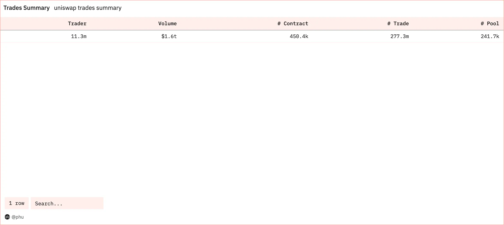

The contracts can be grouped into a few trading routes by referring to contracts' label supported by popular crypto application such as a block explorer, or a crypto analytic platform. In this post, I use label provided by [Dune](https://dune.com/) (the main source), and [Etherscan](https://etherscan.io/) to group the contracts into routes. The routes include (1) Uniswap Frontend, (2) Aggregators, (3) MEV.

If not specified, data in this post is of all time Uniswap history until July 30, 2023.

For general tracking, or if you want to see latest data, please visit this [dashboard](https://dune.com/phu/uniswap-user-origination).

## What are the routes, exactly?

-   Uniswap Frontend is [Uniswap official application](https://app.uniswap.org/), where normal traders use to execute their trades.

-   Aggregators is other DEXs' applications, where normal traders use to execute their trades.

-   MEV is smart contracts, usually called bots, where advance traders use to execute their trades to exploit [MEV](https://ethereum.org/en/developers/docs/mev/).

-   Unknowns is a group of smart contracts, which are not yet labeled.

*Caveat: Uniswap Frontend has a few main contracts called router. Most of 1.8K contracts you see in the chart below are Uniswap v1 pools (exchanges in v1 technical term). In Uniswap v1, pools contract are called directly, which makes it hard to differentiate between (1) trade made on Uniswap application and (2) trade made through API. My assumption here is the v1 pools contracts were mainly called by the type (1) trade. Thus I include all of the contracts in Uniswap Frontend.*

For every 100 contracts called, 79 in Aggregators, 20 in Unknowns, MEV and Uniswap Frontend roughly equally split the rest.

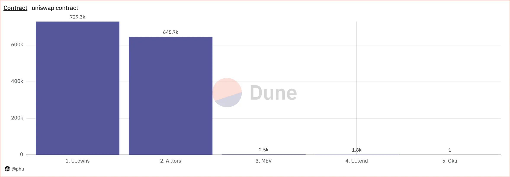

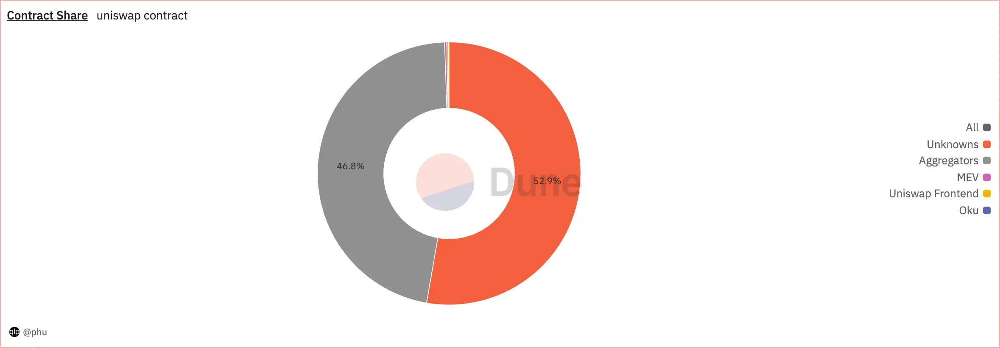

We have learned the definition about the trading routes, which a trader can take to trade in Uniswap pools. The rest of this post, let's explore the routes' role in onboarding trader and growing Uniswap trades.

# Key Takeaways

1.  Uniswap Frontend onboarded the most trader to Uniswap, MEV contributes the most to total Uniswap volume.

2.  About a third of total traders, onboarded by each route, are multi-route traders. Of multi-route traders, two third became multi-route in the first nine weeks. More than half of multi-route traders, who trade on Uniswap Frontend, trade more on Uniswap Frontend than on the other routes. Multi-route traders of Uniswap Frontend and Aggregators, though only account for 1 in every 4-5 traders of each route, account for two third of total volume of each route. However, multi-route traders of MEV and Unknowns only account for 1 in every 5-6 traders and \$1 in every \$6-\$7 volume of each route.

3.  Traders who started Uniswap Frontend or MEV tend to stick longer to their first route than those started with the other routes.

4.  Return traders mainly drive the routes' growth, especially in MEV. In volume, Uniswap Frontend has the fastest weekly growth rate. In number of new trader onboarded to Uniswap, Unknowns has the fastest weekly growth rate. Weekly retention rate of Uniswap Frontend is usually double of those of Aggregators and Unknowns, while only a third of that of MEV.

5.  Other than MEV, both volume and number of trade per week of normal traders of Uniswap Frontend are much higher than those of the other routes.

# Contribution of the routes

## What are the routes' contribution in onboarding new traders to Uniswap?

*A trader is counted to a route if the route onboard the trader to Uniswap, i.e. the trader executed the first Uniswap trade on the route.*

For every 100 traders, 55 started with Uniswap Frontend, 35 started with Aggregators, 9 started with Unknowns, and 1 started with MEV.

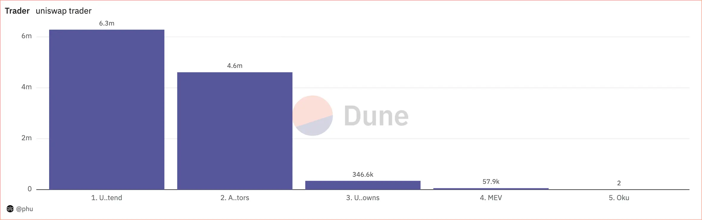

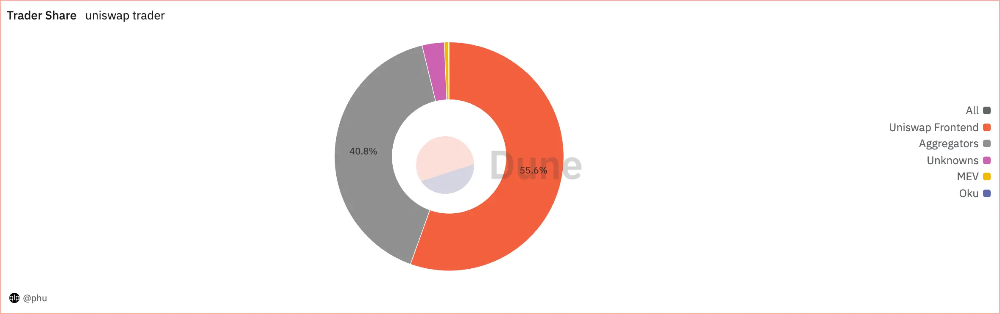

## What are the routes' contribution to total Uniswap volume?

For every \$100 in total volume, \$42 from MEV, \$29 from Uniswap Frontend, \$15 from Aggregators, and \$14 from Unknowns.

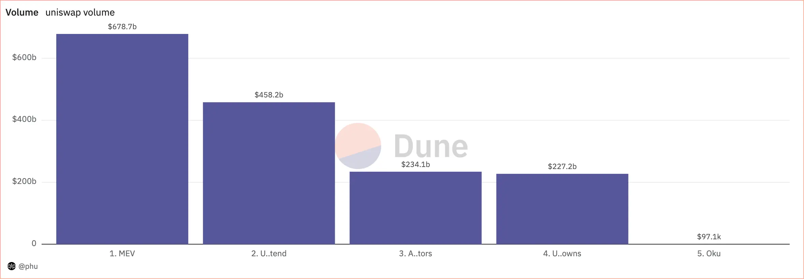

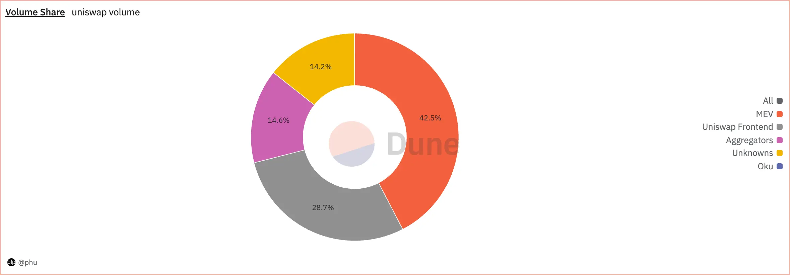

## Do the routes have traders in common?

Yes, the routes have traders in common, i.e. multi-route traders.

For every 100 traders started with Uniswap Frontend, 26 are multi-route traders.

For every 100 traders started with Aggregators, 23 are multi-route traders.

For every 100 traders started with MEV, 38 are multi-route traders.

For every 100 traders started with Unknowns, 26 are multi-route traders.

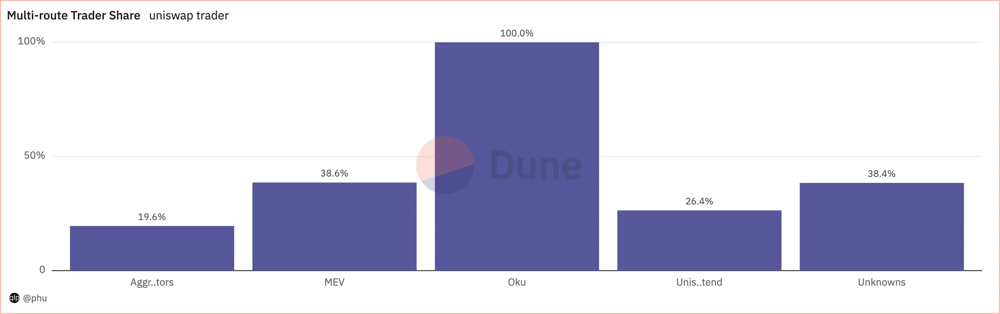

### Ages of single route traders and multi-route traders

Multi-route traders, which average age ranges between 21 weeks (Unknowns) and 40 weeks (Uniswap Frontend), are much older than single route traders, which average age ranges between 3 weeks (MEV) and 8 weeks (Uniswap Frontend).

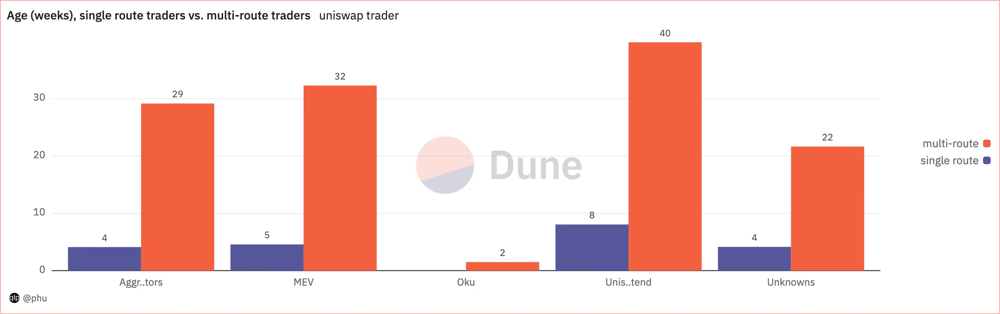

### How many weeks after the first trade, a single route trader become a multi-route trader?

For every 100 multi-route traders, 32 traders became multi-route in the first week (week 0), 31 traders became multi-route between week 1 and week 8, 37 traders became multi-route after week 8.

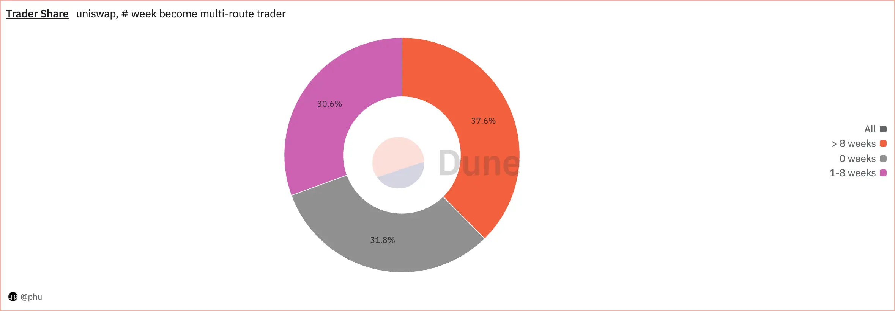

For every 100 traders who started with Uniswap Frontend, then became multi-route, 29 traders became multi-route in week 0, 28 traders became multi-route between week 1 and week 8, 43 traders became multi-route after week 8.

For every 100 traders who started with Aggregators, then became multi-route, 34 traders became multi-route in week 0, 36 traders became multi-route between week 1 and week 8, 30 traders became multi-route after week 8.

For every 100 traders who started with MEV, then became multi-route, 29 traders became multi-route in week 0, 31 traders became multi-route between week 1 and week 8, 40 traders became multi-route after week 8.

For every 100 traders who started with Unknowns, then became multi-route, 42 traders became multi-route in week 0, 33 traders became multi-route between week 1 and week 8, 25 traders became multi-route after week 8.

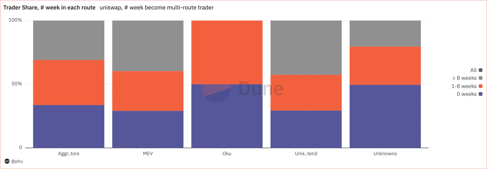

**We learned that**

1.  Uniswap Frontend onboarded the most trader to Uniswap, account for 55 traders in every 100 new traders of Uniswap.

2.  MEV contributes the most to total Uniswap volume, account for \$42 in every \$100 of total Uniswap volume.

3.  About a third of total traders, onboarded by each route, are multi-route traders.

4.  Of multi-route traders, two third became multi-route in the first nine weeks (week 0-8).

5.  Traders who started Uniswap Frontend or MEV tend to become multi-route traders later than those started with the other routes. In other words, traders who started Uniswap Frontend or MEV tend to stick longer to their first route than those started with the other routes.

# Growth of the routes

*I measure growth of a route with weekly growth rate, in volume and in number of trader onboarded by the route. My calculation is based on [exponential growth formula](https://en.wikipedia.org/wiki/Exponential_growth).*

Growth rate is derived from this formula:

$C = I(1 + G)^{T}$

Where $C$, the current value, is total value of \[volume, trader\] the route, $I$, the initial value, is value of the first stable week of the route, i.e. the first week that the route saw trading activity happened on all 7 days, $G$ is growth rate, and $T$ is number of week between $I$ and $C$.

Weekly volume growth rate of the routes range between 6.6% (Aggregators and MEV) and 7.4% (Uniswap Frontend).

Weekly trader growth rate of the routes range between 5% (MEV) and 5.8% (Unknowns).

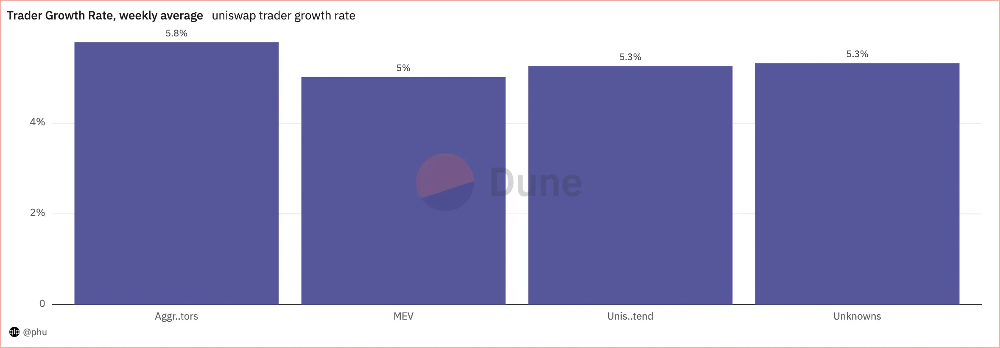

Volume of the routes have grown faster than number of new traders, which the routes onboarded to Uniswap.

## What type of trader, new or return, drive the growth of the routes?

*Traders, who are new to a route, not necessarily new to Uniswap, are the new traders of the route.*

On average, every week, for every 100 traders, the new traders of the routes range between 13 (MEV) and 43 (Aggregators and Unknowns). This implies return traders play a more important role in driving the routes growth.

An other point is despite similar growth rate in volume and number of trader, share of new trader of MEV is only a third of those of other routes.

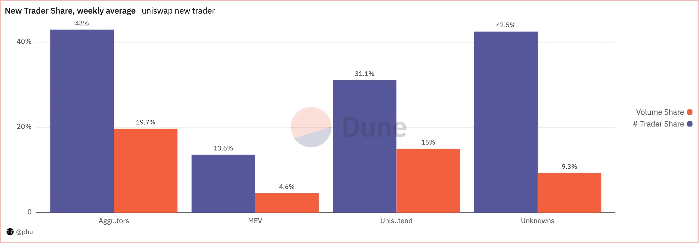

*In case you are not familiar with retention rate, you can read more about it [here](https://amplitude.com/blog/retention-rate-meaning-use-cases-and-more).*

In the first 106 weeks (i.e. the first 2 years), with the first week is week 0:

-   In week 1, retention rate of MEV drop to 48%, while of other routes drop to between 15% and 23%. After that, retention rate of MEV is minimum double, usually triple those of other routes. This offsets the difference in new trader share we learned above, which affects the routes growth.

-   Trailing behind MEV is Uniswap Frontend, which retention rate flat above 4%.

-   After week 100, Aggregators retention rate drop to as low as 2%, and Unknowns rentention rate drop to sub 1%.

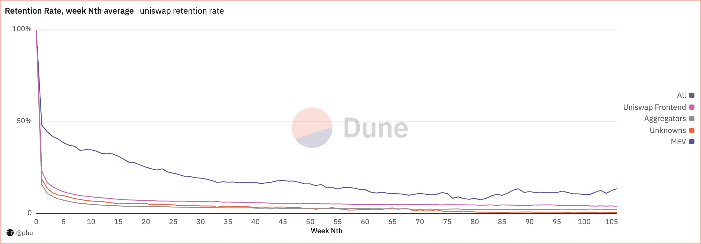

**We learned that**

1.  In volume, Uniswap Frontend has the fastest weekly growth rate, while Aggregators and MEV have the slowest weekly growth rate.

2.  In number of new trader onboarded to Uniswap, Unknowns has the fastest weekly growth rate, while MEV has the slowest weekly growth rate.

3.  Return traders mainly drive the routes' growth, especially in MEV.

4.  Weekly retention rate of Uniswap Frontend is usually double of those of Aggregators and Unknowns, while only a third of that of MEV.

# Trader behavior of the routes

*Behaviors of a trader include (1) volume per week, and (2) number of trade per week. Comparing median values shows the difference between normal traders of the routes. And as average is affected by the weight of large values, comparing average values shows more of the difference between large traders of the routes.*

It is evident that MEV traders have the highest trading volume both in terms of median and average, suggesting they are involved in significant trading activities compared to other categories. The average volume is much higher than the median for all categories, indicating that there might be a few traders with very high volumes skewing the average upwards.

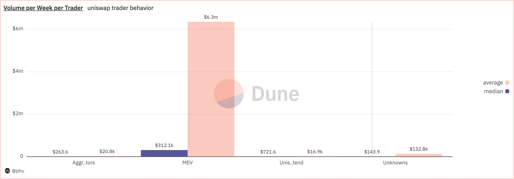

MEV traders have the highest trading activity, with a large gap between the median and average, suggesting that there are some extremely active traders within this group. The other categories show much lower activity, with the average number of trades being higher than the median, which suggests that there are some traders within each category who trade more frequently than the typical trader.

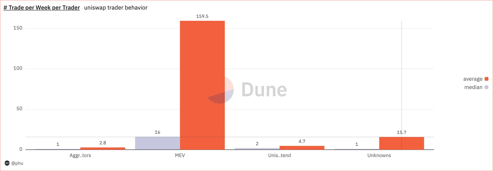

**We learned that**

1.  Volume per week of normal traders of Uniswap Frontend is a fifteenth of that of MEV, and more than triple those of the other 3 routes.

2.  Volume per week of large traders of Uniswap Frontend is less than one hundredth of that of MEV, similar to that of Aggregators, and a third of that of Unknowns.

3.  Number of trade per week of normal traders of Uniswap Frontend is two third of that of MEV and double those of the other routes.

4.  Number of trade per week of large traders of Uniswap Frontend is a fifteenth of that of MEV, a third of that of Unknowns, quite similar to that of Aggreagtors.

# The routes in other angles

## Chain breakdown

From the chart, it's clear that:
- MEV activity is most prominent on Ethereum, indicating a higher engagement in extracting value from transaction ordering.
- Uniswap Frontend and Aggregators have more significant roles on chains like Ethereum, BNB, and Polygon, suggesting these platforms are more utilized for trading on these networks.

The chart highlights how different blockchain ecosystems utilize Uniswap differently, with Ethereum showing the most diversity in trading behavior.

## Pool breakdown

### Major pools

*Pools, which consist of top tokens by TVL, are major pools, otherwise minor pools. The tokens are WETH, USDC, USDT, WBTC, DAI, FRAX, and sETH2. [link](https://info.uniswap.org/#/tokens)*

In each route total volume, MEV traders tend to trade in major pools more than those of other routes.

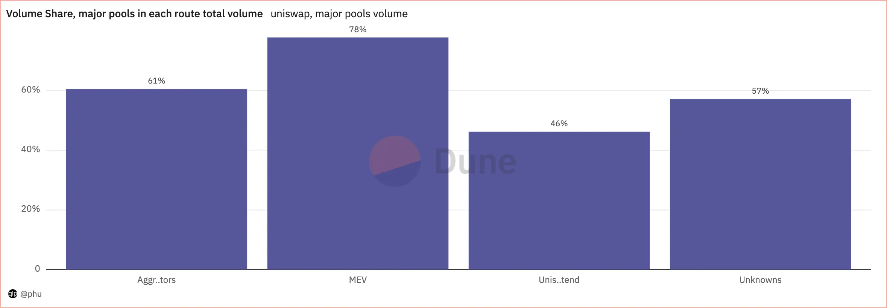

When compare share of each route in major pools total volume to that in all pools total volume, MEV dominates more, while the other routes dominate less.

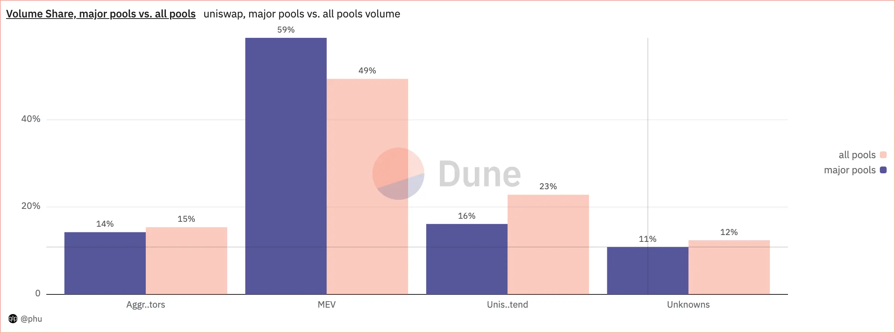

### Stable pools

*Stable pools are pools consist of stablecoins.*

- Aggregators: This category has the highest volume share at 23%. This suggests that a significant portion of the stable pool volume on Uniswap is routed through aggregators.
- MEV (Miner Extractable Value): This category has a volume share of 6%. This indicates that MEV-related transactions account for a smaller portion of the total volume in stable pools.
- Uniswap Frontend: This category represents 13% of the volume share. It might refer to Uniswap's tendency or trend, indicating a moderate share in the stable pool volume.
- Unknowns: This category holds 11% of the volume share. This portion of the volume is not categorized or identified, suggesting some level of uncertainty or miscellaneous routing in the stable pool transactions.

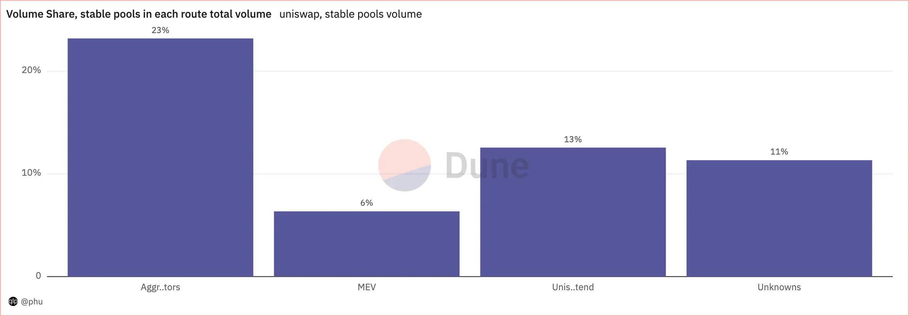

- Stable pools are more utilized by aggregators, which might suggest that these pools are preferred for their stability or efficiency in aggregation strategies.
- MEV activities are more dominant in the broader pool environment, possibly due to the higher volatility and opportunities for arbitrage or front-running in non-stable pools.
- The Uniswap frontend sees a balanced use between stable and all pools, with a slight inclination towards stable pools.
- The 'Unknowns' category does not show a significant difference between stable and all pools, suggesting that this category might encompass various minor or less categorized activities.

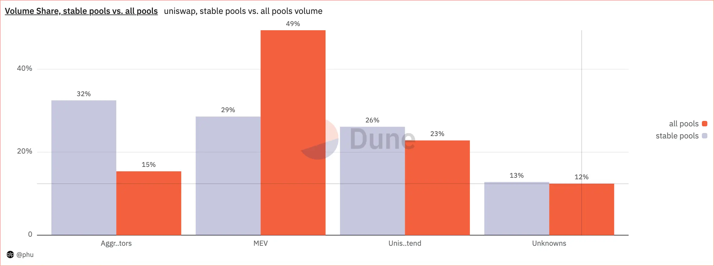

### Top pools

*This section explore 3 largest pools, both in TVL and in 7D volume, as of July 30, 2023, in 3 categories.*

#### USDC / ETH, the largest pool

Majority of the volume comes from MEV, followed by the Uniswap Frontend, Aggregators, and Unknowns in descending order.

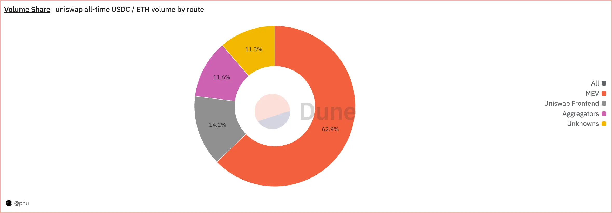

MEV traders tend to trade more in this pool than those of the other routes.

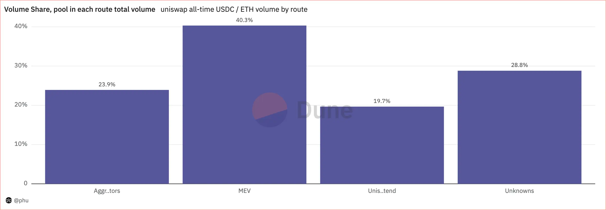

#### USDC / USDT, the largest stable pools

The majority of the volume is split almost equally between "All" and "MEV" routes, with aggregators and the Uniswap frontend accounting for the remaining significant portions.

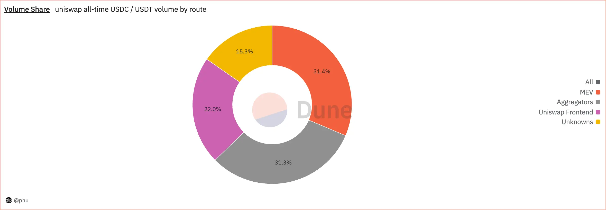

Aggregators traders tend to trade more in this pool than those of the other routes.

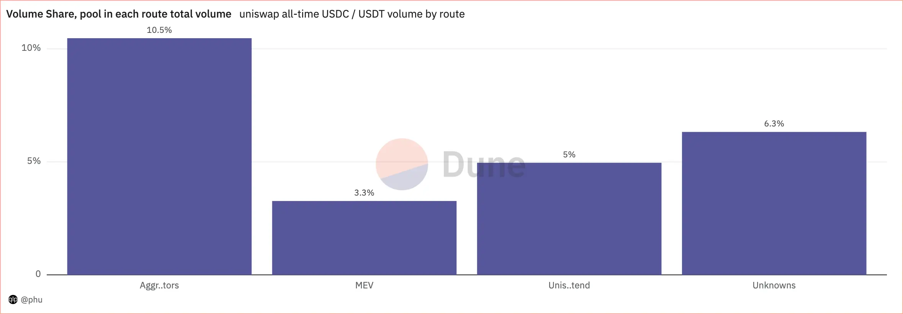

#### PEPE / ETH, the largest meme pool

The chart shows that 40% of the all-time PEPE/ETH volume on Uniswap comes from Uniswap Frontend, 24.3% from MEV, 23.0% from Unknowns, and 12.7% from Aggregators.

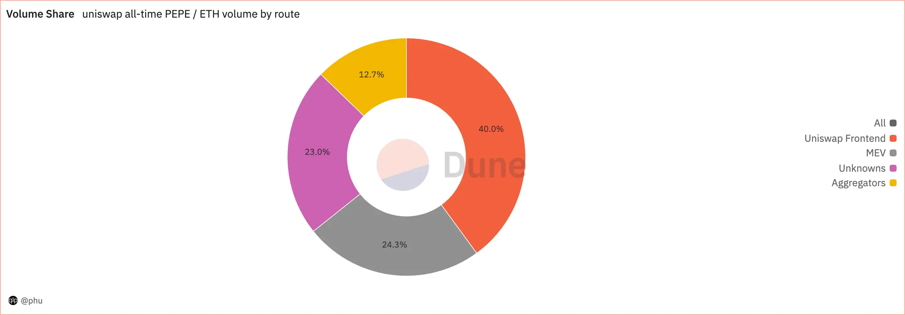

The chart shows that the volume share for all-time PEPE/ETH volume by route on Uniswap is distributed as follows: Aggregators at 0.17%, MEV at 0.10%, Uniswap Frontend at 0.37%, and Unknowns at 0.39%.

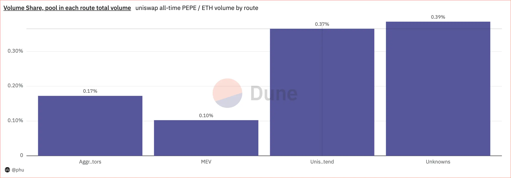

#### Top pools vs. All pools

Traders, who trade through Uniswap Frontend, tend to trade, more in PEPE / ETH, and less in the other 2 pools, than other in all pools.

Traders, who trade through Aggregators, tend to trade, less in USDC / USDT, and more in the other 2 pools, than other in all pools.

Traders, who trade through MEV, tend to trade, more in USDC / ETH, and less in the other 2 pools, than other in all pools.

Traders, who trade through Unknowns, tend to trade, more in PEPE / ETH and USDC / USDT, and less in USDC / ETH, than other in all pools.

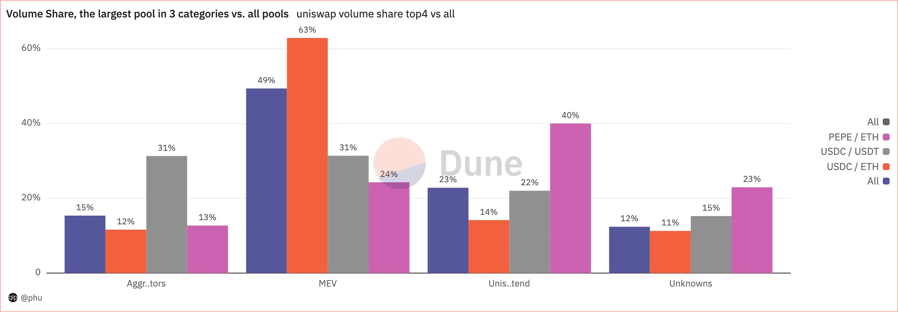

**We learned that**

1.  In term of volume, MEV dominates on Ethereum, while Unknowns dominates on the other chains.

2.  Traders of Aggregators and MEV tend to trade in major pools more than those of other routes.

3.  Traders of Aggregators tend to trade in stable pools more than those of other routes.

4.  In top 4 TVL pools, traders of MEV and Aggregators tend to trade more than those of the other routes. Traders of Uniswap Frontend are least likely to trade in the pools other than DAI / USDC, which traders of MEV are least likely to trade.

5.  When compare to contribution of the routes in all pools:

    -   In major pools, Aggregators and MEV dominate more, while the Uniswap Frontend and Unknowns dominate less.

    -   In stable pools, Aggregators dominates more, while other routes dominate less.

    -   In the largest pool, USDC / ETH, MEV traders tend to trade more in this pool than those of the other routes. In the largest stable pools, USDC / USDT, Aggregatos traders tend to trade more in this pool than those of the other routes. In the largest meme pool, PEPE / ETH, Unknowns and Uniswap Frontend traders tend to trade more in this pool than those of the other routes.

# Dive deeper into each route

*Traders, who are new to each route, are not necessarily new to Uniswap.*

## Uniswap Frontend

Volume of the versions range between \$847M+ (v1) and \$234B+ (v3). For every \$10K in total Uniswap Frontend volume, \$5K in v3, \$4.99K in v2, and \$1 in v1.

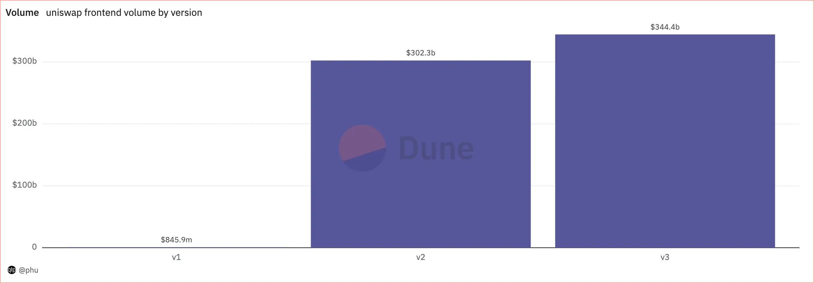

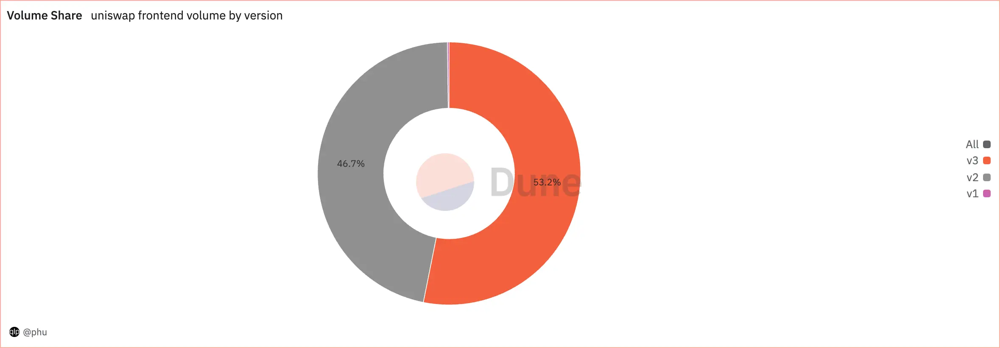

Traders onboarded by the versions range between 73K+ (v1) and 4M (v2). For every 100 traders onboarded to Uniswap Frontend, 55 in v2, 44 in v3, 1 in v1.

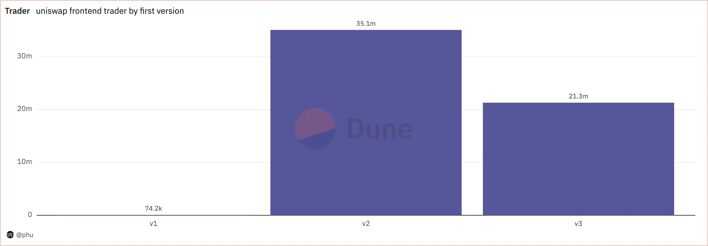

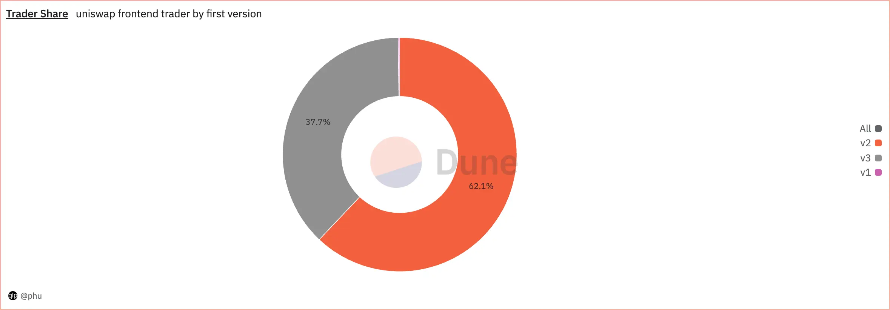

## Aggregators

Volume of top 10 dapps range between \$1.2B (Fei) and \$109B+ (Oneinch). Volume of top 2 dapps are at least double those of the other dapps. For every \$100 in total volume, \$47 in Oneinch, \$18 in Zeroex, \$9 in Gnosis, \$14 in not top 10 dapps, and \$2 in top 4-10 dapps.

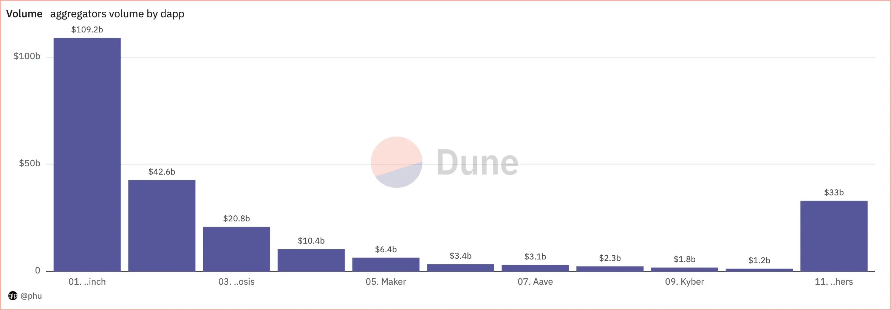

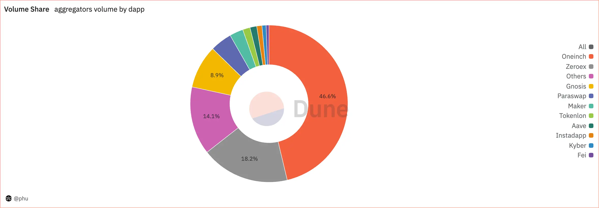

Number of new trader of top 10 dapps range between 2K+ (Fei) and 1.2M (Oneinch). Number of new trader of top 2 dapps are at least 5 folds of the other dapps. For every 100 new traders, 21 in Oneinch, 18 in Zeroex, 54 in not top 10 dapps, and 7 in top 3-10 dapps.

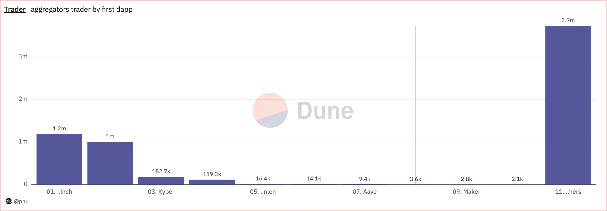

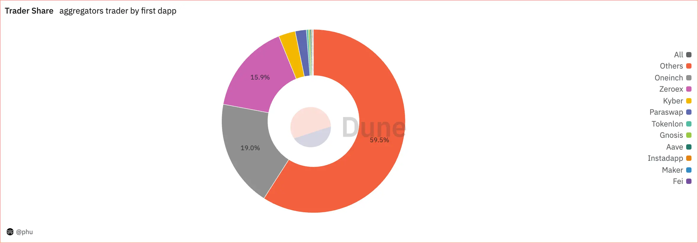

## MEV

Volume of top 10 volume traders range between \$7B+ and \$16B+. Top 10 traders account for \$14 in every \$100 of total MEV volume.

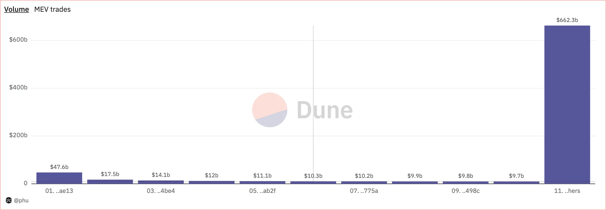

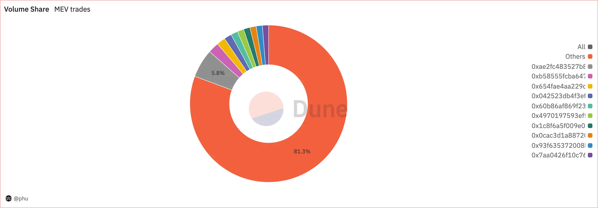

Number of trade of top 10 volume traders range between 4K+ (8th trader) and 103K+ (4th trader).

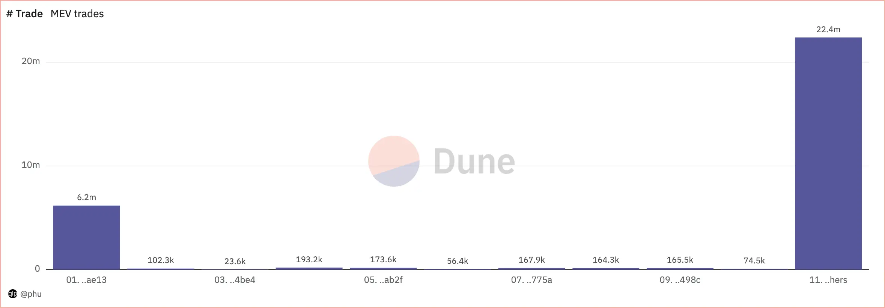

Volume per trade of top 10 volume traders range between \$76K+ (10th trader) and \$2M (8th trader).

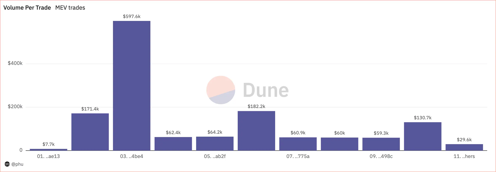

Volume of the largest trader is at least 60% larger than the following ones. The trader accumulates the volume by trade more than most, not all, of the traders in both of number of trade, and volume per trade.

The 8th largest volume trader has number of trade only 1/22 of that of the largest trader, but has volume a half of that of the largest trader by having volume per trade 10 folds of that of the largest trader.

## Unknowns

In Unknowns route, I identify 2 contracts of 2 market makers, which are `0x9507c04b10486547584c37bcbd931b2a4fee9a41` of [Jump Trading](https://www.jumptrading.com/) and `0x00000000ae347930bd1e7b0f35588b92280f9e75` of [Wintermute](http://wintermute.com).

The 2 contracts account for \$11 in every \$100 of total Unknowns volume, 8 trades in every 1000 trades of total Unknowns trades.

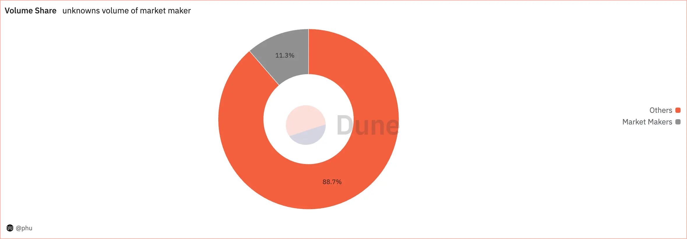

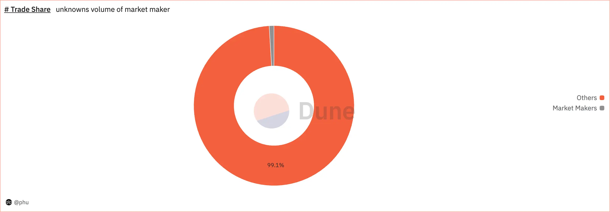

Volume per trade of the 2 market makers range between \$0.6 and \$3.2M, and the mid 50%, i.e. [IQR](https://en.wikipedia.org/wiki/Interquartile_range), range between \$1.7K (TP25) and \$47K+ (TP75).

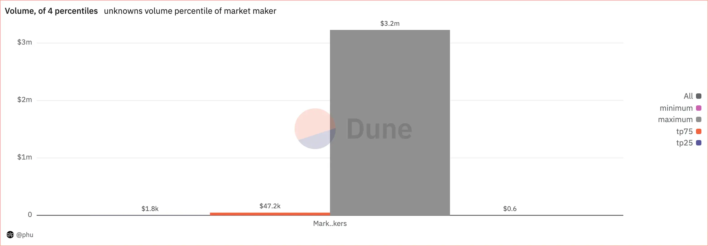

*I use the mid 50% range above as thresholds in an attemp to categorize the Unknowns route. If a contract's TP75 is smaller than \$1.7K then it is `Not a market maker`. If its TP25 \> \$1.7K, it is likely to be a market maker. Otherwise it is not identified, i.e. `Others`. Then I combine the 2 market makers with the likely to be a market maker into one as `Market makers and alikes`.*

Volume of the contract groups range between \$18B+ (Not market maker) and \$161B+ (Market makers and alikes).

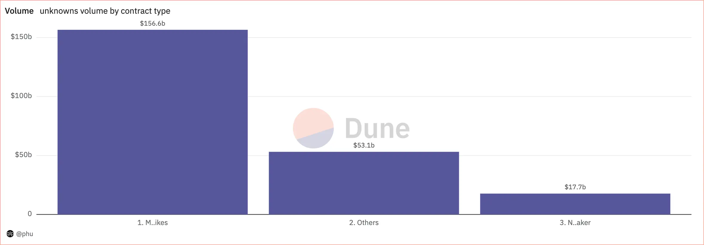

For every \$100 of total Unknowns volume, \$69 in Market makers and alikes, \$23 in Others, and \$8 in Not market maker.

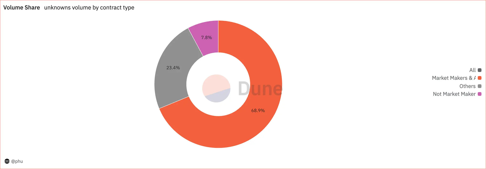

Trader who started with the contract groups range between 8K+ (Market maker and alikes) and 945K+ (Not market maker).

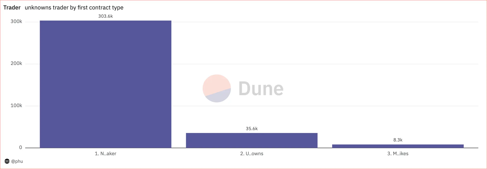

For every 100 traders started with the Unknowns route, 95 in Not market maker, 4 in Others, and 1 in Market makers and alikes.

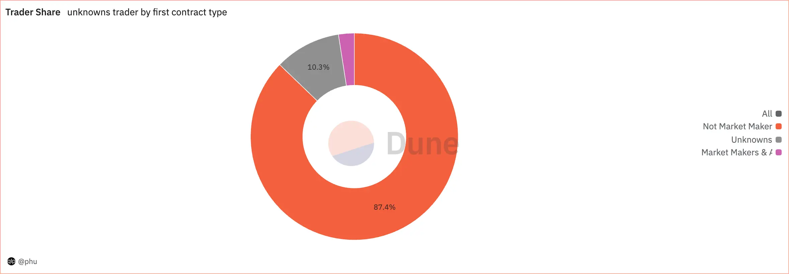

Number of trade of the contract groups range between 7M+ (Marketmaker and alikes) and 40M+ (Not market maker).

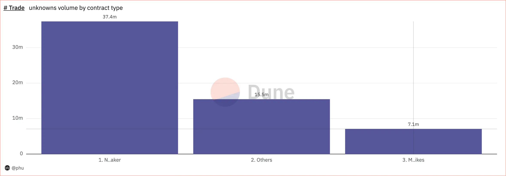

For every 100 trades, 64 in Not market maker, 25 in Others, and 11 in Market makers and alikes.

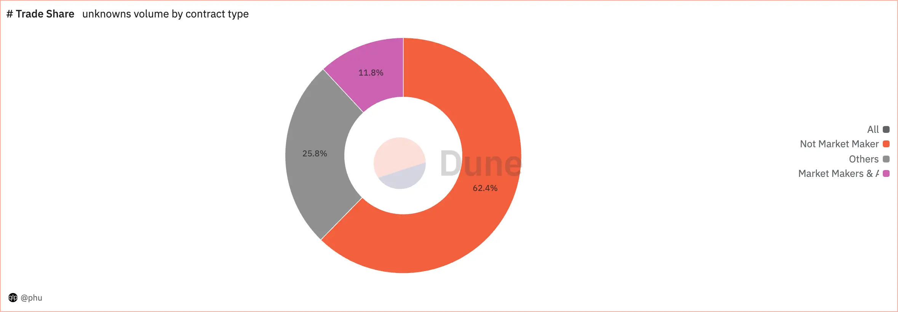

**We learned that**

1.  In Uniswap Frontend:

    -   By version, Uniswap version 2 contributes the most to new trader, while version 3 contributes the most to volume.

    -   By contract groups, Uniswap_v2: Router02 contributes the most to both new trader and volume.

    -   More than half of multi-route traders, who trade on Uniswap Frontend, trade more through Uniswap Frontend than on the other routes. Multi-route traders of Uniswap Frontend and Aggregators, though only account for 1 in every 4-5 traders of each route, account for two third of total volume of each route. However, multi-route traders of MEV and Unknowns only account for 1 in every 5-6 traders and \$1 in every \$6-\$7 volume of each route.

2.  In Aggregators, Oneinch contributes the most to both new trader and volume.

3.  In MEV, the largest volume per trader is \$16B+, the largest number of trade per trader is 103K+, the largest average volume per trade of a trader is \$2M.

4.  In Unknowns, the contract groups of `Market makers and alikes` accounts for more than two third of total volume, but very small in number of trader and number of trade.

# The routes in recent weeks

*This section compares recent 8 weeks ending on July 30, 2023 to all time.*

Volume of the routes all drop in the period of 8 weeks, ending on July 30, 2023.

Uniswap Frontend weekly volume drop 36% from \$2.2B to \$1.4B.

Aggregators weekly volume drop 40% from \$1.1B to \$664M+.

MEV weekly volume drop 67% from \$2B to \$667M.

Unknowns weekly volume drop 35% from \$3.1B to \$2B.

In percentage, MEV drop almost double those of the other 3 routes.

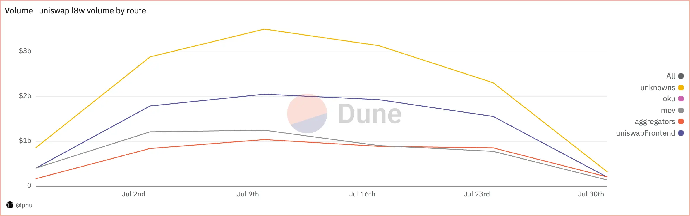

When compare each route volume share in total Uniswap volume of the recent 8 weeks to those of all time:

-   Weekly shares of Uniswap Frontend and Aggregators were mostly lower than all time shares, however the gaps were small compare to the gaps of MEV, which weekly shares were about half of all time volume share.

-   Meanwhile, Unknowns weekly volume shares were mostly triple of all time volume share.

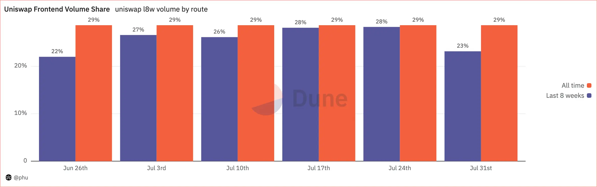

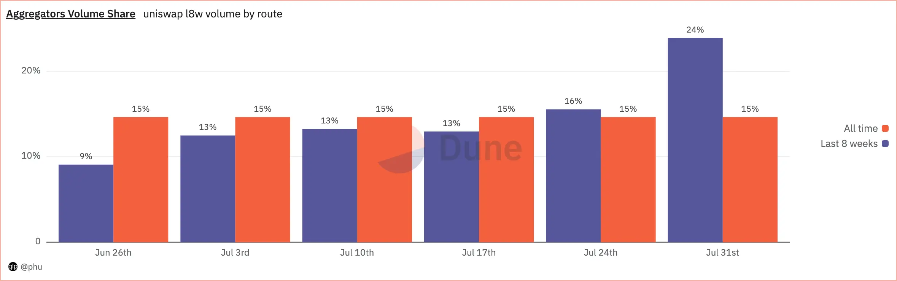

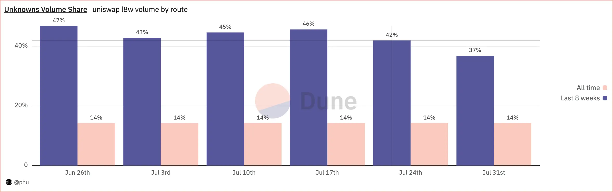

When compare share of number of new trader each route onboarded to Uniswap of the recent 8 weeks to those of all time:

-   Weekly new trader shares of Uniswap Frontend and MEV were lower than all time shares, while weekly new trader shares of Aggregators and Unknowns were higher than all time shares.

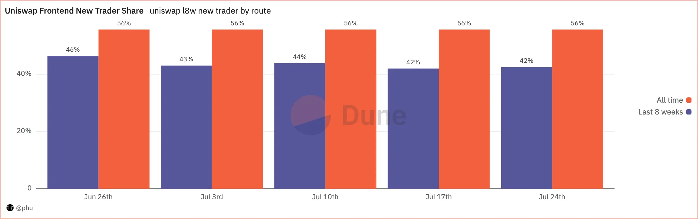

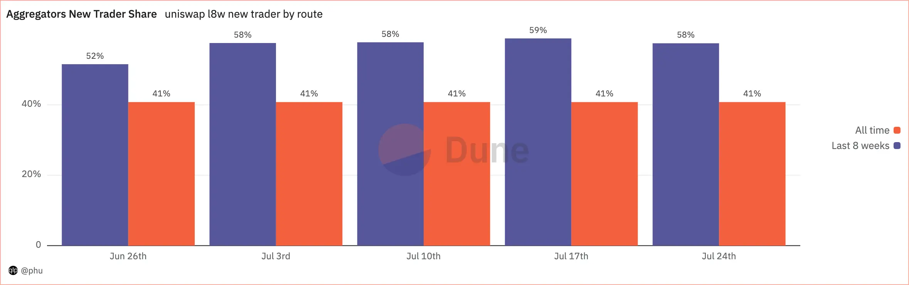

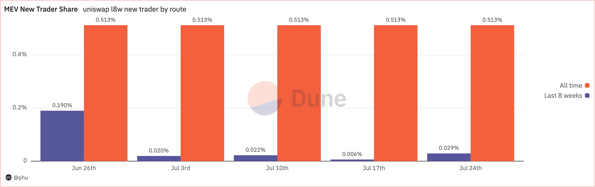

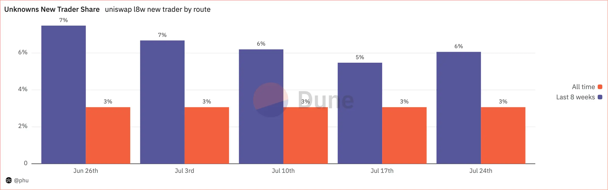

**We learned that**

In recent 8 weeks ending on July 30, 2023:

-   All the routes' weekly volume were generally down.

-   Compare to all time contribution to Uniswap volume, weekly contribution to Uniswap volume of Unknowns tripled, while those of the other 3 routes were lower.

-   Compare to all time contribution to Uniswap new trader, weekly contribution to Uniswap new trader of Aggregators and Unknowns were higher, while those of the other 2 routes were lower.

# Highlights

1.  Uniswap Frontend onboarded the most trader to Uniswap, account for 55 traders in every 100 new traders of Uniswap.

2.  MEV contributes the most to total Uniswap volume, account for \$42 in every \$100 of total Uniswap volume.

3.  About a third of total traders, onboarded by each route, are multi-route traders.

4.  Of multi-route traders, two third became multi-route in the first nine weeks.

5.  Traders who started Uniswap Frontend or MEV tend to become multi-route traders later than those started with the other routes. In other words, traders who started Uniswap Frontend or MEV tend to stick longer to their first route than those started with the other routes.

6.  In volume, Uniswap Frontend has the fastest weekly growth rate, while Aggregators and MEV have the slowest weekly growth rate.

7.  In number of new trader onboarded to Uniswap, Unknowns has the fastest weekly growth rate, while MEV has the slowest weekly growth rate.

8.  Return traders mainly drive the routes' growth, especially in MEV.

9.  Weekly retention rate of Uniswap Frontend is usually double of those of Aggregators and Unknowns, while only a third of that of MEV.

10. Volume per week of normal traders of Uniswap Frontend is a fifteenth of that of MEV, and more than triple those of the other 3 routes.

11. Volume per week of large traders of Uniswap Frontend is less than one hundredth of that of MEV, similar to that of Aggregators, and a third of that of Unknowns.

12. Number of trade per week of normal traders of Uniswap Frontend is two third of that of MEV, and double those of the other routes.

13. Number of trade per week of large traders of Uniswap Frontend is a fifteenth of that of MEV, a third of that of Unknowns, quite similar to that of Aggreagtors.

14. In term of volume, MEV dominates on Ethereum, while Unknowns dominates on the other chains.

15. Traders of Aggregators and MEV tend to trade in major pools more than those of other routes.

16. Traders of Aggregators tend to trade in stable pools more than those of other routes.

17. In top 4 TVL pools, traders of MEV and Aggregators tend to trade more than those of the other routes. Traders of Uniswap Frontend are least likely to trade in the pools other than DAI / USDC, which traders of MEV are least likely to trade.

18. When compare to contribution of the routes in all pools:

    -   In major pools, Aggregators and MEV dominate more, while the Uniswap Frontend and Unknowns dominate less.

    -   In stable pools, Aggregators dominates more, while other routes dominate less.

    -   In the largest pool, USDC / ETH, MEV traders tend to trade more in this pool than those of the other routes. In the largest stable pools, USDC / USDT, Aggregatos traders tend to trade more in this pool than those of the other routes. In the largest meme pool, PEPE / ETH, Unknowns and Uniswap Frontend traders tend to trade more in this pool than those of the other routes.

19. In Uniswap Frontend:

    -   By version, Uniswap version 2 contributes the most to new trader, while version 3 contributes the most to volume.

    -   By contract groups, Uniswap_v2: Router02 contributes the most to both new trader and volume.

    -   More than half of multi-route traders, who trade on Uniswap Frontend, trade more through Uniswap Frontend than on the other routes. Multi-route traders of Uniswap Frontend and Aggregators, though only account for 1 in every 4-5 traders of each route, account for two third of total volume of each route. However, multi-route traders of MEV and Unknowns only account for 1 in every 5-6 traders and \$1 in every \$6-\$7 volume of each route.

20. In Aggregators, Oneinch contributes the most to both new trader and volume.

21. In MEV, the largest volume per trader is \$16B+, the largest number of trade per trader is 103K+, the largest average volume per trade of a trader is \$2M.

22. In Unknowns, the contract groups of `Market makers and alikes` accounts for more than two third of total volume, but very small in number of trader and number of trade.

23. In recent 8 weeks ending on July 30, 2023:

    -   All the routes' weekly volume were generally down.

    -   Compare to all time contribution to Uniswap volume, weekly contribution to Uniswap volume of Unknowns tripled, while those of the other 3 routes were lower.

    -   Compare to all time contribution to Uniswap new trader, weekly contribution to Uniswap new trader of Aggregators and Unknowns were higher, while those of the other 2 routes were lower.

# Updates

This post won the 1st prize of the bounty #27 of Unigrants Community Analytics Program 🥳.

<blockquote class="twitter-tweet">

🎉 <a href="https://twitter.com/UniswapFND?ref_src=twsrc%5Etfw">@UniswapFND</a> - Community Analytics - Bounty #27 winners 🎉   Our community analysed User Origination on Uniswap!  Kudos to our winners:   🥇 <a href="https://twitter.com/0xphu?ref_src=twsrc%5Etfw">@0xphu</a> 🥈 Zohan 🥉 <a href="https://twitter.com/ConsideredFin?ref_src=twsrc%5Etfw">@ConsideredFin</a>  Great analysis on how users access Uniswap so check it out 👇

--- 0xMartijnB (@0xMartijnB) <a href="https://twitter.com/0xMartijnB/status/1689240426434240512?ref_src=twsrc%5Etfw">August 9, 2023</a>
</blockquote>

